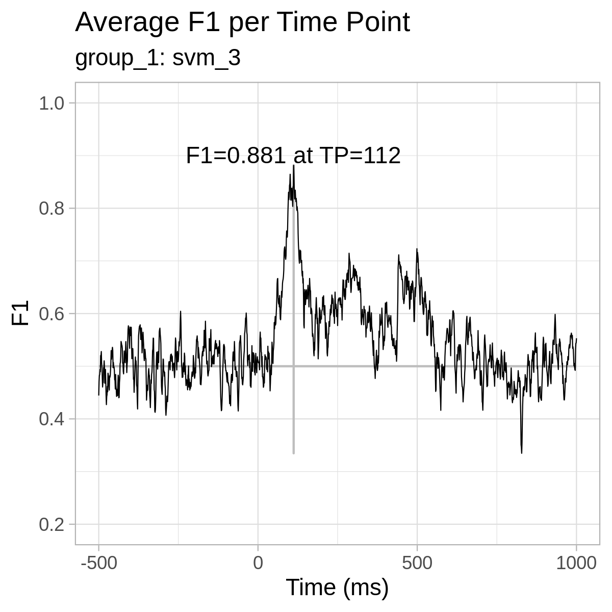
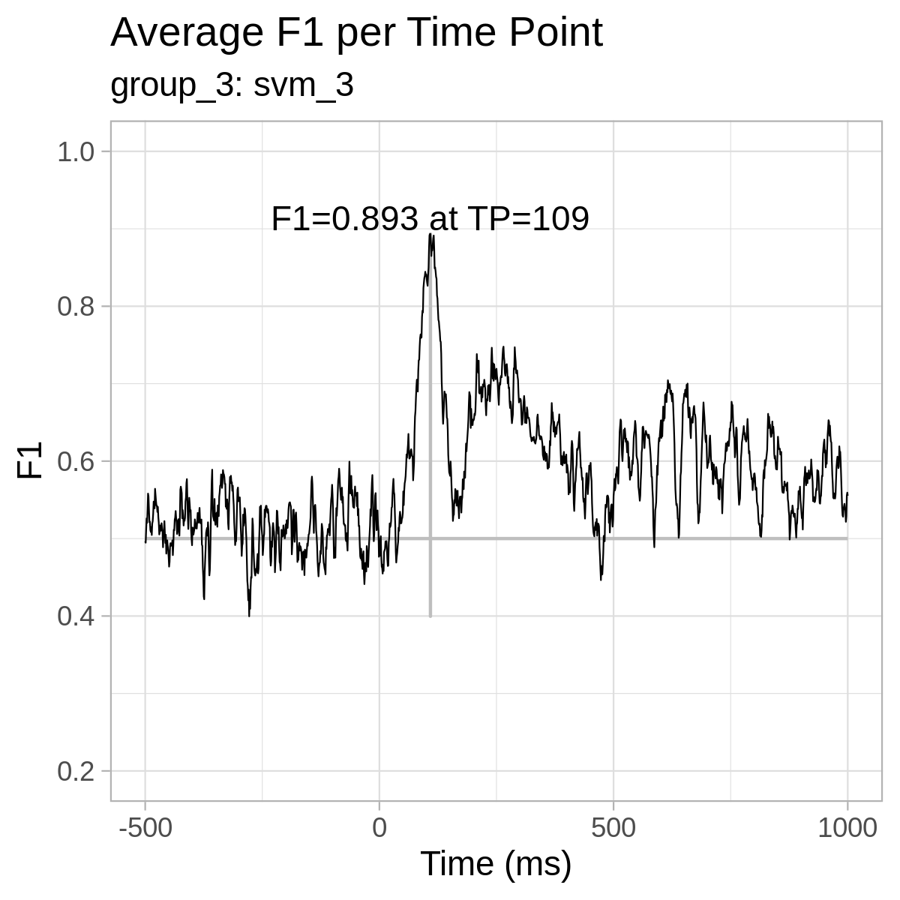
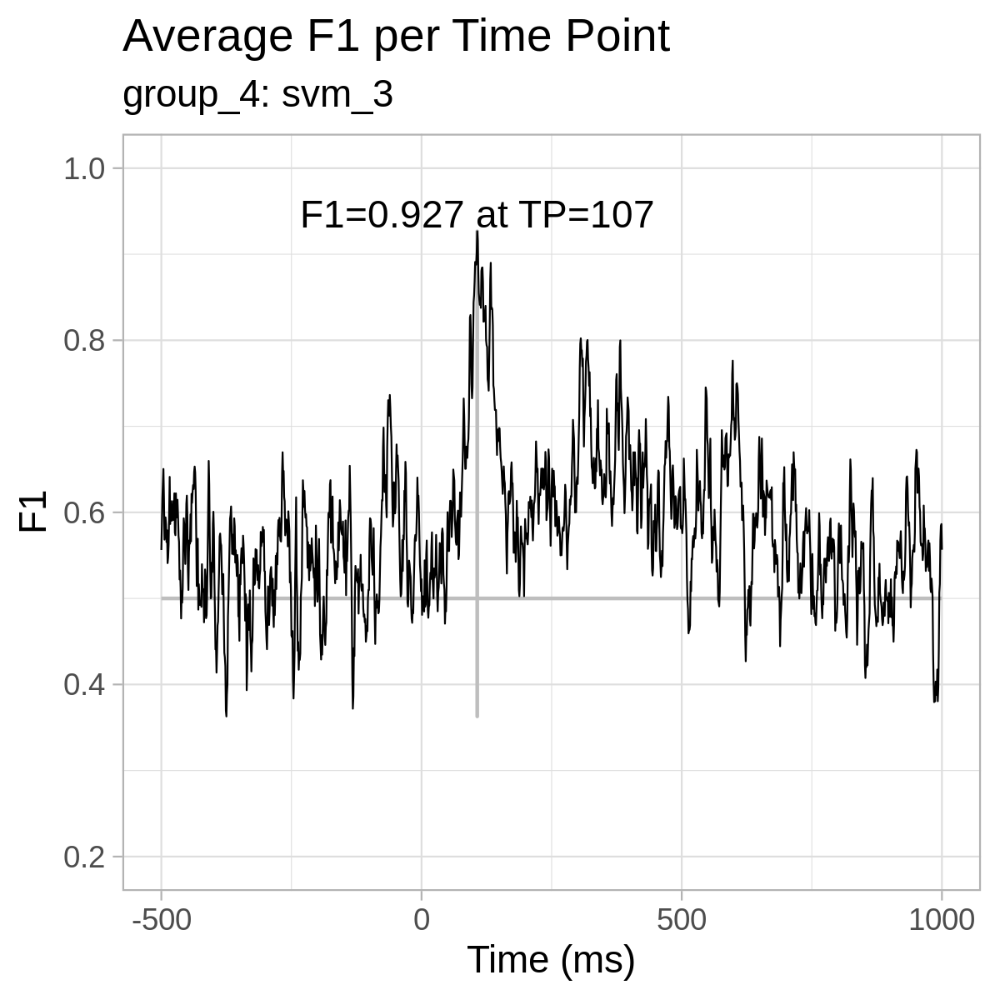
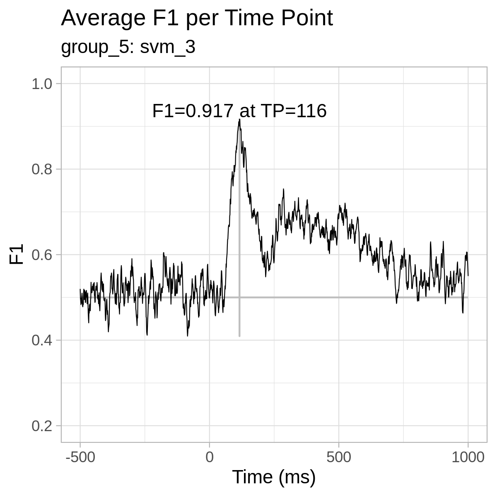
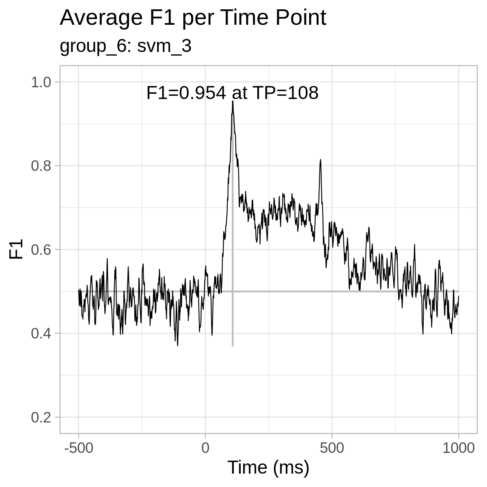
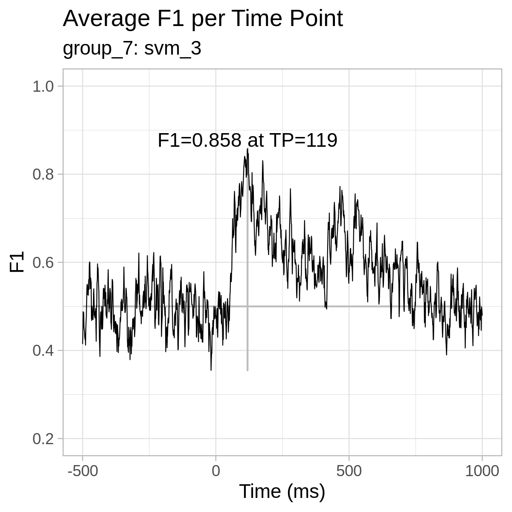

# MEG-fMRI-group2
MEG (and possibly later fMRI) analysis scripts for study group at Adv. Cognitive Neuroscience, Aarhus University.

For each group:
* Expects numpy .npy file with shape `(trials, sensors, time points)`.
* This file should be put in `data/group_x/`.
* Then you run `precompute_time_point_data.py` (change variables first).
* Now you can run either `single_time_point_analysis.py`, for testing the code on a single time point, or `all_time_points_analysis.py`, for repeated cross-validation of each time point. This can take quite a while.
* You can define custom model functions in `models.py`.
* Results are put in `results/time_point_models/single/group_x/`.
* You can use `plot_time_point_results.R` to plot your results. The images will be saved as a .tif file, which you can use directly or convert to png.

While there is code for running leave-one-group-out cross-validation, it is quite slow and doesn't seem to get good results. It's possible that some kind of windowed analysis (e.g. blocks of 10 time points) could work better.

For help: Please ask questions in an issue here on GitHub so everyone can see the answer :)

For **reference only**, here are the plots from our results:
 

  

    
    
    
    
    
    
  

 
